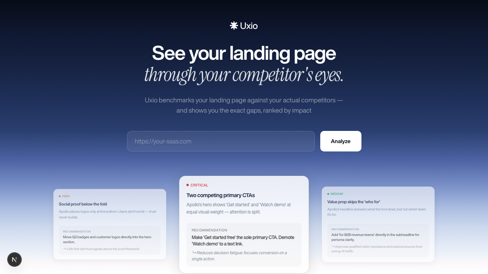
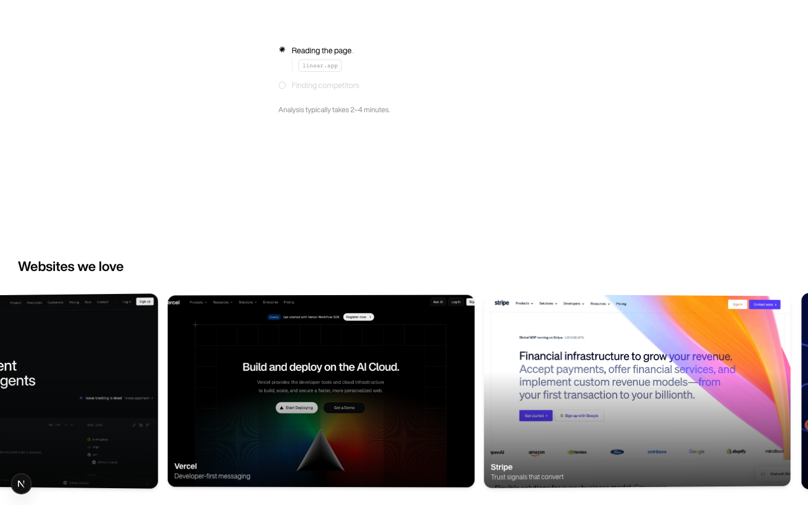

# Uxio — AI Competitive Landing Page Analyzer

**The honest audit your landing page needs.**

Paste any SaaS URL → Uxio benchmarks it against your top competitors and delivers prioritized design recommendations backed by specific copy and visual evidence — hero, CTAs, trust signals, and more.



---

## What it does

1. **Identifies your product category** from your landing page
2. **Discovers top 3 direct competitors** via web search + LLM knowledge
3. **Scrapes competitor landing pages** — full screenshots + markdown content
4. **Classifies page sections** (hero, pricing, social proof, features, CTA, footer…)
5. **Analyzes each section** for strengths, weaknesses, and scores across 10 axes across 3 groups (Communication, Conversion, Visual)
6. **Generates prioritized recommendations** — critical, high, and medium priority — each citing specific evidence from competitor pages
7. **Shows which competitors were used** — the results header displays "Compared with [CompetitorA], [CompetitorB], ..." with favicons, so you know exactly what the analysis is based on
8. **Caches results** for 2 hours — revisiting the same URL (with or without a trailing slash) shows results instantly without re-running the pipeline
9. **Warns on subpage URLs** — if you enter a subpage (e.g. `/pricing`), an amber notice recommends your homepage for better competitor matching; analysis still proceeds
10. **Exports a PDF** of the full analysis with one click
11. **Notifies you** via browser notification when analysis finishes while the tab is in the background (gracefully handles incognito/denied permissions with a fallback message)

Results stream in real time via Server-Sent Events (SSE). The full analysis takes ~1.5–3 minutes.

---

## How it works

A 7-agent sequential pipeline runs entirely on the server:

| # | Agent | What it does | APIs |
|---|-------|-------------|------|
| 0 | Page Intelligence | Extracts product brief + category classification | Firecrawl + AI Gateway (Gemini Flash-Lite) |
| 1 | Multi-Signal Discovery | Finds competitors via 3 weighted searches + LLM knowledge | Tavily + AI Gateway (Gemini Flash-Lite) |
| 2 | Competitor Validator | Scores and ranks the top 3 | AI Gateway (Gemini Flash-Lite) |
| 3 | Scraper | Reuses Agent 0 scrape for input; two-pass scrape of competitor pages | Firecrawl |
| 4 | Section Classifier | Identifies and deduplicates page sections | AI Gateway (Gemini Flash-Lite) |
| 5 | Vision Analyzer | Analyzes screenshots + markdown (capped 8 sections/page, competitors filtered to input types) | AI Gateway (Gemini Flash, multimodal) |
| 6 | Synthesis | Produces 2 recommendations per section (top 5 sections) + executive summary | AI Gateway (Gemini Flash, structured output) |

All LLM calls go through **Vercel AI Gateway** with automatic fallback chains (Gemini 2.5 Flash → GPT-5.4-nano). Agent 5 caps to 8 sections per page and filters competitor pages to only section types present on the input page — this keeps multimodal calls focused and fast. Agent 6 selects the top 5 sections by competitive gap and generates 2 recommendations each (10 total). Fatal pipeline errors are logged with full stack traces for debugging. Each agent streams a `progress` SSE event as it completes. The final `complete` event carries the full result along with a quality validation report.

---

## Scoring Rubric

Every section is scored across **10 axes in 3 groups**, weighted by their impact on SaaS conversion:

| Group | Weight | Axes |
|-------|--------|------|
| **Communication** | 1.5× | Clarity, Specificity, ICP Fit |
| **Conversion** | 1.2× | Attention Ratio, CTA Quality, Trust Signals |
| **Visual** | 1.0× | Visual Hierarchy, Cognitive Ease, Typography Readability, Density Balance |

Every insight must reference specific copy or a named visual element — generic observations are rejected at the prompt level.

A **quality gate** scores each completed analysis across 5 signals: evidence grounding (30%), score variance (25%), specificity rate (20%), competitor presence (15%), and field completeness (10%). This report is attached to the `complete` SSE event and logged in non-production environments.

---

## Getting Started

### Prerequisites

- Node.js 22+
- API keys for **Firecrawl**, **Tavily**, and **Google Gemini**

### 1. Clone the repo

```bash
git clone https://github.com/your-username/uxio.git
cd uxio
```

### 2. Install dependencies

```bash
npm install
```

### 3. Set up environment variables

```bash
cp .env.local.example .env.local
```

Open `.env.local` and fill in your API keys:

```env
FIRECRAWL_API_KEY=your_firecrawl_api_key_here
TAVILY_API_KEY=your_tavily_api_key_here
GEMINI_API_KEY=your_gemini_api_key_here
```

> `AI_GATEWAY_URL` is not in the example file — it is set in the Vercel dashboard and can be pulled locally with `vercel env pull .env.local`. Local development works without it.

### 4. Run the dev server

```bash
npm run dev
```

Open [http://localhost:3000](http://localhost:3000) and paste a SaaS landing page URL to start.

---

## Environment Variables

| Variable | Required | Where to get it |
|----------|----------|-----------------|
| `FIRECRAWL_API_KEY` | Yes | [firecrawl.dev](https://www.firecrawl.dev) |
| `TAVILY_API_KEY` | Yes | [tavily.com](https://tavily.com) |
| `GEMINI_API_KEY` | Yes | [aistudio.google.com](https://aistudio.google.com/app/apikey) |
| `AI_GATEWAY_URL` | Yes (prod) | Vercel AI Gateway base URL — set in the Vercel dashboard; use `vercel env pull .env.local` to pull it locally |

All keys are server-side only — never exposed to the client.

---

## Tech Stack

| Layer | Technology |
|-------|-----------|
| Framework | Next.js 16 (App Router) |
| Runtime | React 19 |
| AI Orchestration | Vercel AI SDK v6 |
| Web Scraping | Firecrawl |
| Web Search | Tavily |
| LLM / Vision | Google Gemini 2.5 Flash |
| Styling | Tailwind CSS v4 |
| UI Components | shadcn/ui (base-nova style) |
| Animations | Framer Motion |
| PDF Export | @react-pdf/renderer |
| Analytics | Vercel Analytics + Speed Insights |
| Deployment | Vercel |

---

## Screenshots

**Home — input form:**


**Analysis in progress — live agent pipeline:**



---

## Project Structure

```
uxio/
├── app/
│   ├── api/
│   │   ├── analyze/route.ts      # Main SSE endpoint — runs the pipeline
│   │   ├── validate-url/route.ts # Pre-flight URL reachability check
│   │   └── indexnow/route.ts     # IndexNow submission endpoint
│   ├── error.tsx                  # Error boundary (retry UI)
│   ├── global-error.tsx           # Root layout crash fallback
│   ├── layout.tsx
│   └── page.tsx
├── proxy.ts                       # Security headers (CSP, HSTS, X-Frame-Options)
├── components/
│   ├── analysis/
│   │   ├── AnalysisForm.tsx       # Main form + state machine
│   │   ├── ProgressPanel.tsx      # Real-time agent progress
│   │   ├── ResultsPanel.tsx       # Final results view
│   │   ├── InspirationGallery.tsx # Auto-scrolling 3D card gallery
│   │   └── results/               # Sub-components (SectionCard, ScoreBadge…)
│   ├── layout/
│   └── ui/                        # shadcn/ui primitives
├── lib/
│   ├── agents/
│   │   ├── orchestrator.ts        # Pipeline runner
│   │   ├── agent0.ts … agent6-synthesis.ts
│   │   ├── prompts.ts             # All Gemini system prompts + AGENT_PROMPTS
│   │   └── errors.ts
│   ├── ai/gateway.ts              # Vercel AI Gateway + MODELS + CHAINS fallback
│   ├── constants.ts               # SECTION_LABELS, VALID_SECTION_TYPES, PRIORITY_COLORS
│   ├── env.ts                     # Zod env var validation (lazy)
│   ├── site-url.ts                # Canonical SITE_URL from env vars
│   ├── sse.ts                     # SSE stream helper
│   ├── types/analysis.ts          # All TypeScript types
│   ├── utils.ts                   # cn() class merge + toSentenceCase() helpers
│   └── utils/
│       ├── json-extract.ts        # Safe LLM JSON parsing
│       ├── normalize-section-type.ts # Canonical SectionType normalization
│       ├── scrape-quality.ts      # Markdown usability check
│       ├── markdown-clean.ts      # stripMarkdownLinks() + stripInlineCode() + stripBoilerplate()
│       ├── ssrf.ts                # isUnsafeUrl() — shared by API routes + agents
│       ├── url.ts                 # getHostname() + getHostnameOrEmpty()
│       ├── score.ts               # getScoreColor() + getGradeLabel()
│       └── quality-scorer.ts      # Analysis quality gate (5-signal score)
└── .env.local.example
```

---

## Scripts

```bash
npm run dev    # Start dev server (Turbopack, default in Next.js 16)
npm run build  # Production build
npm run lint   # ESLint check
npm start      # Production server
```

---

## Deployment

The easiest way to deploy is with [Vercel](https://vercel.com):

1. Push your repo to GitHub
2. Import the repo on [vercel.com/new](https://vercel.com/new)
3. Add the four environment variables in the Vercel dashboard
4. Deploy

The API route requires Node.js runtime (not Edge) — Vercel handles this automatically based on the `runtime` export in the route file.

> **Note:** Set `maxDuration` to at least 300s in your Vercel plan. The route already exports `maxDuration = 300`; ensure your Vercel plan supports it (Pro plan required for >60s functions).

---

## API Security

- **Rate limiting**: 2 requests per minute per IP (in-memory)
- **SSRF protection**: HTTP and HTTPS; blocks private IP ranges (127.x, 10.x, 192.168.x, 172.16–31.x, 169.254.x) and non-standard ports — applied to user input URLs and Firecrawl-returned screenshot URLs
- **CORS**: Origin header validated against host — cross-origin requests rejected
- **Security headers**: CSP (with `*.gstatic.com` for Google favicon redirects), X-Frame-Options (DENY), X-Content-Type-Options, Referrer-Policy, Permissions-Policy, HSTS — via `proxy.ts`
- **Env validation**: Required API keys validated via Zod on first use — clear error messages if missing
- **Input validation**: hostname must contain `.`; any HTTP response (including 4xx/5xx) is treated as reachable — only network failures are rejected
